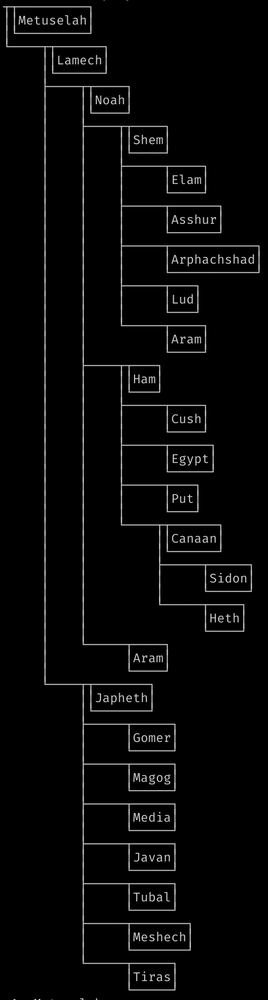
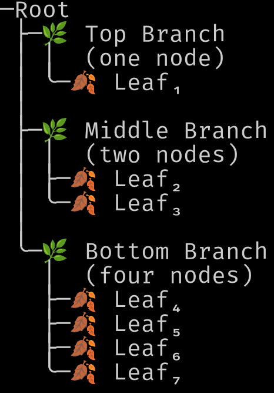
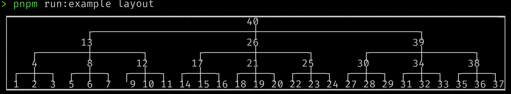
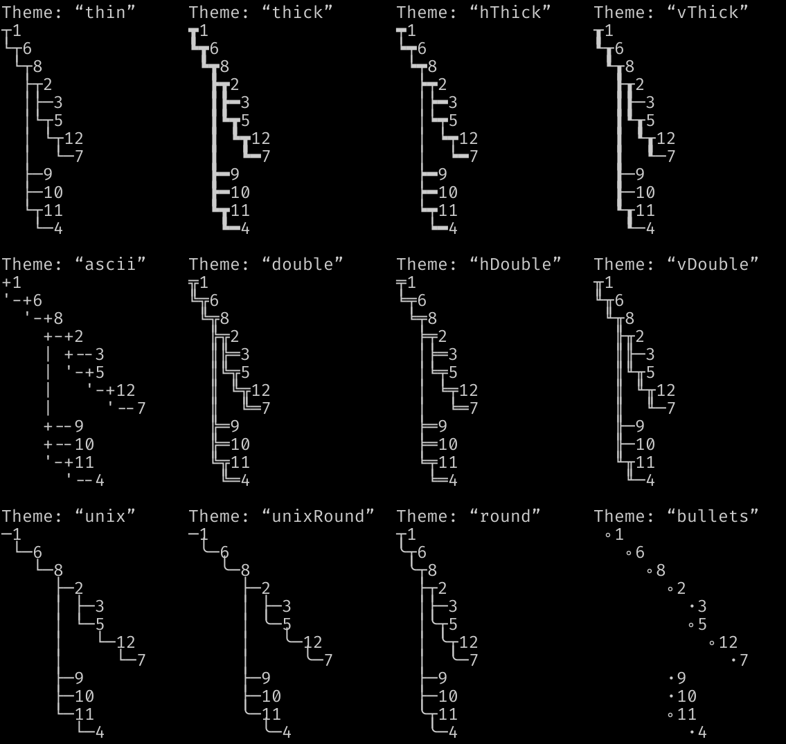

# Features

1. [Tree Operations](#tree-operations)
2. [Tree Codecs](#tree-codecs)
3. [Tree Instances](#tree-instances)
4. [Tree Generation](#tree-generation)
5. [Drawing Trees](#drawing-trees)

## Tree Operations

1. A generic tree data structure and all the basic functions required to manipulate immutable instances.
1. A zipper for navigation and efficient modification.
1. Measure node counts/heights/depth/degree, crop by depth, filter trees, unfold level trees, select subtrees, zip/unzip trees, and traverse in any order.
1. Annotate nodes with their _level index_, for example `2.3.11.1`, encoding their _path from root_.
1. Numeric and boolean folds on nodes. For example _sum_ all nodes, find maximum node value for some given order, or check if all nodes are `true`. All operations short-circuit whenever possible.
1. Folds can operate on entire trees, _replace_ nodes, _annotate_ nodes, and are composable to tuples and structs. This allows you to _count nodes_, _annotate with depth_, and _crop depth_, for example, in a single fused iteration over the tree.

## Tree Codecs

Encode/decode losslessly to/from different tree encodings.

| Name            | Codec Source                                                                      |
| --------------- | --------------------------------------------------------------------------------- |
| Nested arrays   | [source](https://github.com/middle-ages/effect-tree/tree/main/src/codec/arrays)   |
| Edge lists      | [source](https://github.com/middle-ages/effect-tree/tree/main/src/codec/edges)    |
| Indented string | [source](https://github.com/middle-ages/effect-tree/tree/main/src/codec/indented) |
| Path List       | [source](https://github.com/middle-ages/effect-tree/tree/main/src/codec/paths)    |
| Prüfer codes    | [source](https://github.com/middle-ages/effect-tree/tree/main/src/codec/prufer)   |

[Law tests](https://github.com/middle-ages/effect-tree/blob/main/src/codec/Isomorphism.test.ts) test encode/decode round-trip.

## Tree Instances

| Name        | Instance                                                                                    | Typeclass                                                                                     | Laws                                                                                                              |
| ----------- | ------------------------------------------------------------------------------------------- | --------------------------------------------------------------------------------------------- | ----------------------------------------------------------------------------------------------------------------- |
| Applicative | [source](https://github.com/middle-ages/effect-tree/blob/main/src/instances/Applicative.ts) | [source](https://github.com/Effect-TS/effect/blob/main/packages/typeclass/src/Applicative.ts) | [source](https://github.com/middle-ages/effect-ts-laws/tree/main/src/laws/typeclass/parameterized/Applicative.ts) |
| Covariant   | [source](../src/instances/Covariant.ts)                                                     | [source](https://github.com/Effect-TS/effect/blob/main/packages/typeclass/src/Covariant.ts)   | [source](https://github.com/middle-ages/effect-ts-laws/tree/main/src/laws/typeclass/parameterized/Covariant.ts)   |
| Equivalence | [source](https://github.com/middle-ages/effect-tree/blob/main/src/instances/Equivalence.ts) | [source](https://github.com/Effect-TS/effect/blob/main/packages/effect/src/Equivalence.ts)    | [source](https://github.com/middle-ages/effect-ts-laws/tree/main/src/laws/typeclass/concrete/Equivalence.ts)      |
| Foldable    | [source](https://github.com/middle-ages/effect-tree/blob/main/src/instances/Foldable.ts)    | [source](https://github.com/Effect-TS/effect/blob/main/packages/typeclass/src/Foldable.ts)    | [source](https://github.com/middle-ages/effect-ts-laws/tree/main/src/laws/typeclass/parameterized/Foldable.ts)    |
| Monad       | [source](https://github.com/middle-ages/effect-tree/blob/main/src/instances/Monad.ts)       | [source](https://github.com/Effect-TS/effect/blob/main/packages/typeclass/src/Monad.ts)       | [source](https://github.com/middle-ages/effect-ts-laws/tree/main/src/laws/typeclass/parameterized/Monad.ts)       |
| Order       | [source](https://github.com/middle-ages/effect-tree/blob/main/src/instances/Order.ts)       | [source](https://github.com/Effect-TS/effect/blob/main/packages/effect/src/Order.ts)          | [source](https://github.com/middle-ages/effect-ts-laws/tree/main/src/laws/typeclass/concrete/Order.ts)            |
| Traversable | [source](https://github.com/middle-ages/effect-tree/blob/main/src/instances/Traversable.ts) | [source](https://github.com/Effect-TS/effect/blob/main/packages/typeclass/src/Traversable.ts) | [source](https://github.com/middle-ages/effect-ts-laws/tree/main/src/laws/typeclass/parameterized/Traversable.ts) |

Laws are listed
_[in the book of laws](https://middle-ages.github.io/effect-ts-laws-docs/catalog-of-laws.html)_
and law tests
[can be found here](https://github.com/middle-ages/effect-tree/blob/main/src/instances/laws.test.ts).

Functions like [mapEffect](https://middle-ages.github.io/effect-tree-docs/functions/effect-tree.mapEffect.html)
and
[traverseEffect](https://middle-ages.github.io/effect-tree-docs/variables/effect-tree.traverseEffect.html) that run
a _effectful_ functions on the tree have pre-order variants at the `pre` key of
the function. For example, the
[mapEffect.pre](https://middle-ages.github.io/effect-tree-docs/functions/effect-tree.mapEffect.html#pre)
function will traverse the tree in depth-first pre-order.

## Tree Generation

1. A customizable arbitrary for trees with variants for branches, ordered numeric trees, and more.
1. Enumerate trees and go forwards and backwards in the list of possible labeled trees for better control of test data.

| [Basic](https://github.com/middle-ages/effect-tree/blob/main/examples/basic.ts)         | Create a tree, add/remove nodes, and other basic use-cases.               |
| [Codecs](https://github.com/middle-ages/effect-tree/blob/main/examples/codecs.ts)       | Encode/decode the same tree through all codecs.                           |
| [Draw](https://github.com/middle-ages/effect-tree/blob/main/examples/draw.ts)           | Draw trees in various themes.                                             |
| [Fibonacci](https://github.com/middle-ages/effect-tree/blob/main/examples/fibonacci.ts) | A custom fold: unfold the Fibonacci sequence into a linear tree.          |
| [Folds](https://github.com/middle-ages/effect-tree/blob/main/examples/folds.ts)         | Fusing folds into tuples and structs.                                     |
| [Genealogy](https://github.com/middle-ages/effect-tree/blob/main/examples/genealogy.ts) | Level labels, bottom grounded subtrees, and encoding to indented strings. |
| [Generate](https://github.com/middle-ages/effect-tree/blob/main/examples/generate.ts)   | Enumerate and generate trees.                                             |
| [Layout](https://github.com/middle-ages/effect-tree/blob/main/examples/layout.ts)       | Alternate tree layouts using the `Draw` module.                           |

## Drawing Trees

Draw trees for terminal output. Customize layout and symbols, and compose
layouts from _parts_. All functions are ANSI text aware and should work with
styled text and wide characters.

Click on the example screenshots to go to the source code.

- You can place anything in multiline node labels, even boxes.

- Show emojis.

- Build custom layouts.

- Theme the glyphs.

