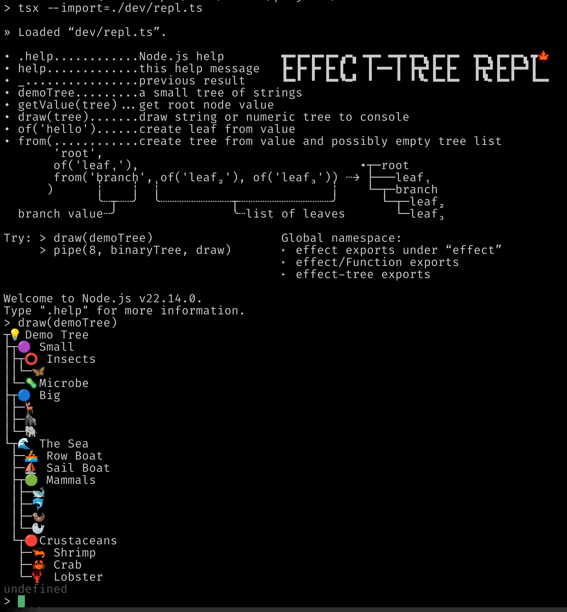

# Examples

## Running

### Stackblitz

Has [containers ready to run](https://stackblitz.com/~/github.com/middle-ages/effect-tree) the examples.

### Locally

You can run the examples locally. For example to run the `basic` example clone this repository, and launch the example:

```sh
git clone git@github.com:middle-ages/effect-tree.git
cd effect-tree
pnpm i
pnpm run:example draw

# Run with no parameters to get a list of examples
pnpm run:example

# This should work the same 
pnpm tsx examples/draw.ts
```

### Browsing

The expected terminal output of each example appears inline with the source code.

| Example                                                                                           | Note                                                                      |
| ------------------------------------------------------------------------------------------------- | ------------------------------------------------------------------------- |
| [basic](https://github.com/middle-ages/effect-tree/blob/main/examples/basic.ts)                   | Create a tree, add/remove nodes, and other basic use-cases.               |
| [codecs](https://github.com/middle-ages/effect-tree/blob/main/examples/codecs.ts)                 | Encode/decode the same tree through all codecs.                           |
| [directory-tree](https://github.com/middle-ages/effect-tree/blob/main/examples/directory-tree.ts) | Read directories into trees and write directories from trees.             |
| [draw](https://github.com/middle-ages/effect-tree/blob/main/examples/draw.ts)                     | Draw trees in various themes.                                             |
| [fibonacci](https://github.com/middle-ages/effect-tree/blob/main/examples/fibonacci.ts)           | A fold and an unfold all about the Fibonacci sequence.                    |
| [folds](https://github.com/middle-ages/effect-tree/blob/main/examples/folds.ts)                   | Fusing folds into tuples and structs.                                     |
| [genealogy](https://github.com/middle-ages/effect-tree/blob/main/examples/genealogy.ts)           | Level labels, bottom grounded subtrees, and encoding to indented strings. |
| [generate](https://github.com/middle-ages/effect-tree/blob/main/examples/generate.ts)             | Enumerate and generate trees.                                             |
| [layout](https://github.com/middle-ages/effect-tree/blob/main/examples/layout.ts)                 | Alternate tree layouts using the `Draw` module.                           |
| [nary](https://github.com/middle-ages/effect-tree/blob/main/examples/nary.ts)                     | N-ary trees: trees with a fixed degree.                                   |
| [unfolds](https://github.com/middle-ages/effect-tree/blob/main/examples/unfolds.ts)               | Unfold a tree from functions.                                             |
| [zipper](https://github.com/middle-ages/effect-tree/blob/main/examples/zipper.ts)                 | Use a zipper to navigate and change trees.                                |

### REPL

Running `pnpm repl` (or `tsx dev/repl.ts`) will run the [Node.js REPL](https://nodejs.org/api/repl.html) with symbols useful for
quick experimentation [added to the global scope](https://github.com/middle-ages/effect-tree/blob/main/dev/repl.ts).

Type `help` for more info. You should see this:

```txt
> tsx --import=./dev/repl.ts
» Loaded “dev/repl.ts”.

• .help............Node.js help
• help.............this help message
• _................previous result
• demoTree.........a small tree of strings
• getValue(tree)...get root node value
• draw(tree).......draw string or numeric tree to console
• of('hello')......create leaf from value
• from(............create tree from value and possibly empty tree list
       'root',
       of('leaf₁'),                               •┬─root
       from('branch', of('leaf₂'), of('leaf₃')) ┄→ ├───leaf₁
      )      ┊    ┊  ┊                        ┊    └─┬─branch
             ╰┄┬┄┄╯  ╰┄┄┄┄┄┄┄┄┄┄┬┄┄┄┄┄┄┄┄┄┄┄┄┄╯      └─┬─leaf₂
  branch value┄╯                ╰┄list of leaves       └─leaf₃

Try: > draw(demoTree)                  Global namespace:
     > pipe(8, binaryTree, draw)       ‣ effect exports under “effect”
                                       ‣ effect/Function exports
                                       ‣ effect-tree exports

Welcome to Node.js v22.14.0.
Type ".help" for more information.
>
```

Here is a screenshot of REPL run:


