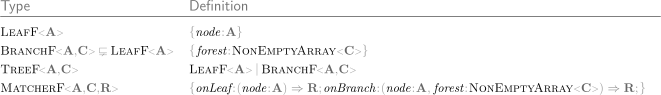

# `effect-ts-tree` Source

1. [TreeF (src)](#treef-src)
   1. [TreeF\<A, C\> Types](#treefa-c-types)
   2. [TreeF\<A, C\> Functions](#treefa-c-functions)
2. [Tree (src)](#tree-src)
   1. [Tree\<A\> Types](#treea-types)
   2. [Tree\<A\> Functions](#treea-functions)

## TreeF ([src](./treeF/index.ts))

### TreeF&lt;A, C&gt; Types

### TreeF&lt;A, C&gt; Functions

 

Some functions have curried versions:

 

Some require an Applicative instance for `F`:

## Tree ([src](./tree/index.ts))

### Tree&lt;A&gt; Types

### Tree&lt;A&gt; Functions

 

Some functions have curried versions:

 

Some require an Applicative instance for `F`:

