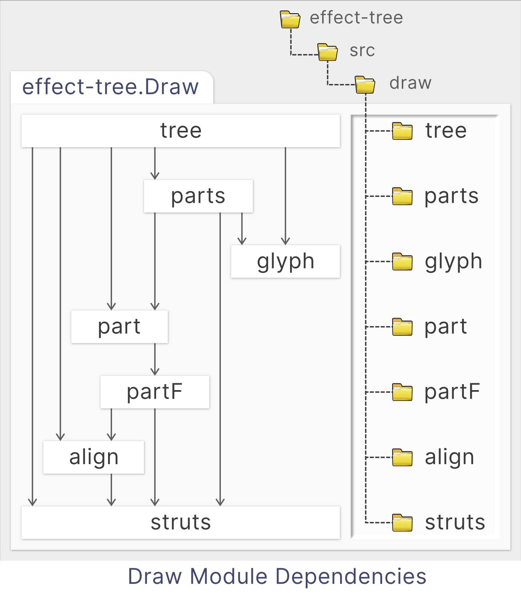

# Draw Module

A simple compositional terminal drawing library that is just good enough to show some recursive structures in diagrams. You use it to build parts, combine them in various ways to build bigger parts, then render them to the terminal.

1. [Overview](#overview)
2. [Parts](#parts)
   1. [Creating](#creating)
   2. [Sizing Parts](#sizing-parts)
3. [Struts](#struts)
   1. [Drawing Struts](#drawing-struts)
   2. [Overflow](#overflow)
4. [Trees](#trees)
5. [Modules](#modules)

## Overview

Parts can be placed next to each other with a direction and an alignment so that the smaller parts will be stretched and the resulting part will always remain a rectangular area. The library is used for drawing trees here because this placement of parts next to each other can be done with no measuring or computing of sizes.

This is also the main limitation of the library- there is no way to measure part sizes until they are rendered. You cannot render parts while you are computing their content so we use block alignment and the _struts_ feature described below to get around this limitation.

## Parts

You will find here functions to build _parts_, which are rectangular blocks of glyphs. They are rectangular because they will render to a rectangle of text on a terminal. A part never has any holes or jagged edges: every area of the rectangle is filled.

There are four types of the parts, two are atomic and two composite. All other parts are composed from these four:

1. Atomic
   1. [Empty](https://middle-ages.github.io/effect-tree-docs/types/effect-tree.Draw.Empty.html). The empty type.
   1. [Text](https://middle-ages.github.io/effect-tree-docs/types/effect-tree.Draw.Text.html). A part that shows some text.
1. Composite
   1. [Row](https://middle-ages.github.io/effect-tree-docs/types/effect-tree.Draw.Row.html). Children are distributed horizontally according to alignment.
   1. [Column](https://middle-ages.github.io/effect-tree-docs/types/effect-tree.Draw.Column.html). Children are distributed vertically according to alignment.

### Creating

The functions [text](https://middle-ages.github.io/effect-tree-docs/functions/effect-tree.Draw.text.html), [row](https://middle-ages.github.io/effect-tree-docs/functions/effect-tree.Draw.row.html), and [column](https://middle-ages.github.io/effect-tree-docs/functions/effect-tree.Draw.column.html) are the basic ways to create the four part types, with the empty part exported as the constant [empty](https://middle-ages.github.io/effect-tree-docs/variables/effect-tree.Draw.empty.html).

```ts
import {box, column, drawPart, empty, row, text} from 'effect-tree/draw'

// Two lists of text.
const leftCells = [text('↑'), text('left|'), text('↓')]
const rightCells = [text('↑'), text('|right'), text('↓')]

// A pair of columns.
const leftColumn = column.left(leftCells)
const rightColumn = column.right(rightCells)

// A row with the column pair and the empty part.
const bottomRow = row('middle')('center')([leftColumn, empty, rightColumn])

console.log(drawPart.unlines(box()(bottomRow)))
// ┌───────────┐
// │↑         ↑│
// │left||right│
// │↓         ↓│
// └───────────┘
```

### Sizing Parts

Part sizes are defined entirely by their content and padding. When they are aligned, they grow to match the widest or tallest in their row or column, depending on the axis.

The area created when aligning is, together with any explicit padding, the available space that is left for filling with non-content. You can set how this empty area created by the alignment is rendered by setting _struts_ on each of the four directions. Struts have a fixed prefix and suffix but their bodies stretch out to fill available space.

The struts are set by default to empty space, as that is what you usually expect as padding, however we set specific glyphs to draw borders, separators, connectors and other elements where size depends on content.

When your parts are ready, the `drawPart` function will recursively fold the part into a list of string rows for display.

## Struts

The glyphs used to fill available space between and around shapes are determined by the `Strut`.

By default it is set to the space character, which is usually what you want surrounding your text when it is being aligned.

The strut can be a character, like the space configured by default, and it will be repeated to fill available space.

However the type for `Strut` also has a _prefix_ and a _suffix_, and its body can be any length, which simplifies some types of drawings described below. For example a horizontal strut is defined as a triplet of:

1. A prefix string.
1. A body string.
1. A suffix string.

the prefix and suffix are optional, and by default they are set to the empty string so that available space fills uniformly with spaces.

### Drawing Struts

A strut is drawn by shapes to fill some available space when aligning and padding. A horizontal strut is N glyphs _wide_ and one glyph _high_. A vertical strut is N glyphs _high_ and zero glyphs _wide_.

A horizontal strut, for example, is drawn so:

1. First we draw the prefix.
1. Next we repeat the body to fill available space leaving space for the
   prefix and suffix.
1. Finally we draw the suffix.

This makes it easy to build parts that stretch to adapt to neighboring parts _without_ measuring or doing any math. For example, leaving a top row of your shape empty, will fill it with a single character of the vertical struct.  This will not take any space, so a horizontal strut will be used to fill the top line. If it is created so:

```ts
const topHorizontalLineStrut = strut.horizontal(
  '├╴╼┅┉┄┈ ',                 // prefix 9 glyphs wide
  ['1', '2', '3', '4', '5'],  // body   5 glyphs wide
  ' ┈┄┉┅╾╌╶┤',                // suffix 9 glyphs wide
)
  ↑    ↑    ↑    ↑
  ┈┈┈┈┈┈┈┈┈┈┈┈┈┈┈┈ruler
  0123456789012345
```

Note the `body` (the second argument) must be given as a non-empty string array to ensure we always have at least a single glyph with which to fill available space.

Then a line 30 glyphs wide part configured with the `topHorizontalLineStrut` above will be filled so:

```txt
 ├╴╼┅┉┄┈ 1234512345123 ┈┄┉┅╾╌╶┤

↑    ↑    ↑    ↑    ↑    ↑    ↑    ↑
0    5   10   15   20   25   30   35
┈┈┈┈┈┈┈┈┈┈┈┈┈┈┈┈┈┈┈┈┈┈┈┈┈┈┈┈┈┈┈┈┈┈┈┈ruler
012345678901234567890123456789012345
```

A 20 glyphs wide part will be draw so:

```txt
 ├╴╼┅┉┄┈ 123 ┈┄┉┅╾╌╶┤

↑    ↑    ↑    ↑    ↑    ↑    ↑    ↑
0    5   10   15   20   25   30   35
┈┈┈┈┈┈┈┈┈┈┈┈┈┈┈┈┈┈┈┈┈┈┈┈┈┈┈┈┈┈┈┈┈┈┈┈ruler
012345678901234567890123456789012345
```

This is useful, for example when drawing responsive borders, separators, and connectors.

### Overflow

When available space is less than prefix width + a single body width + suffix width, the strut _overflows_. Overflow is cropped by priority.

First we try to remove from the right edge of the _body_ of the strut.

If the entire body was removed but we still overflow, remove in equal measure from the prefix and the suffix, removing from the tail of the prefix and the head of the suffix, so that the last two glyphs remaining are the head glyph of the prefix and the last glyph of the suffix.

If there is only a single space left, the final character of the suffix is clipped so that only the 1st character of the prefix is left.

A 5 glyph wide part will be draw so:

```txt
 ├╴╼┅ ┅╾╌╶┤

↑    ↑    ↑
0    5   10
┈┈┈┈┈┈┈┈┈┈┈ruler
01234567890
```

At a width of 2 glyphs:

```txt
 ├┤

↑    ↑    ↑
0    5   10
┈┈┈┈┈┈┈┈┈┈┈ruler
01234567890
```

And when there is only a single space to fill:

```txt
 ├

↑    ↑    ↑
0    5   10
┈┈┈┈┈┈┈┈┈┈┈ruler
01234567890
```

## Trees

Trees can be _themed_, which just means that they get a theme as an argument and they can use it to theme how they draw. For example a part could depend not on individual _glyphs_, E.g.: `┌` but instead on glyph _roles_, for example the role `elbow`, and then a theme could set the glyph for the role to `╭` to get rounded corners.

## Modules

Useful functions are mostly found in the packages
<a alt="part" href="https://github.com/middle-ages/effect-tree/tree/main/src/draw/part">part</a> and above. These are all the internal modules of `Draw`:

<table>
<tr>
<td style="border-width: 0 !important">
<ol>
<li><a alt="tree" href="https://github.com/middle-ages/effect-tree/tree/main/src/draw/tree">tree</a>: Parts for drawing trees and the <a alt="drawKey" href="https://middle-ages.github.io/effect-tree-docs/functions/effect-tree.Draw.drawTree.html">drawTree function</a>.  
<li><a alt="parts" href="https://github.com/middle-ages/effect-tree/tree/main/src/draw/parts">parts</a>: Various useful parts, for example the <a alt="box" href="https://middle-ages.github.io/effect-tree-docs/functions/effect-tree.Draw.box.html">box</a> part.
<li><a alt="glyph" href="https://github.com/middle-ages/effect-tree/tree/main/src/draw/glyph">glyph</a>: Sugar for accessing glyphs that are helpful when line drawing on the terminal.
<li><a alt="part" href="https://github.com/middle-ages/effect-tree/tree/main/src/draw/part">part</a>: A basic abstraction for working with rectangular blocks of text.
<li><a alt="partF" href="https://github.com/middle-ages/effect-tree/tree/main/src/draw/partF">partF</a>: The non-recursive version of <code>Part</code>.
<li><a alt="align" href="https://github.com/middle-ages/effect-tree/tree/main/src/draw/align">align</a>: Aligning text and filling available space created with struts.
<li><a alt="struts" href="https://github.com/middle-ages/effect-tree/tree/main/src/draw/struts">struts</a>: Functions to fill empty parts of rectangular blocks of text.
</ol>
</td>
<td style="border-width: 0 !important">

</td>
</td>
</table>
